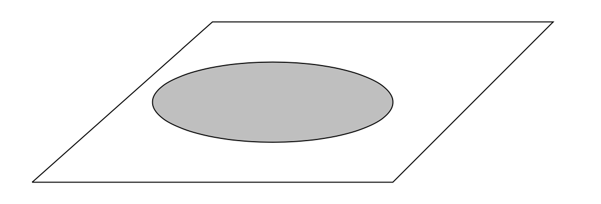
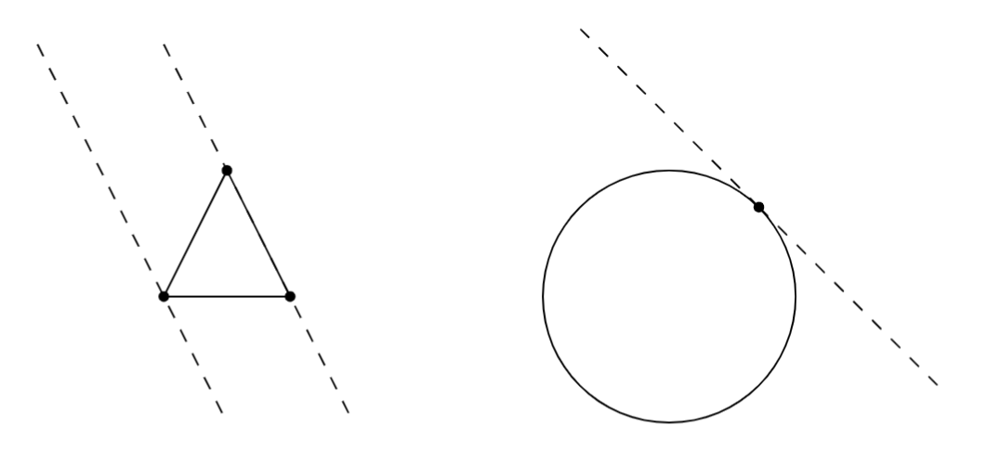

# Discrete Geometrie I

## Week 01

Content: Convex sets, convex hulls, Minkowski sum and Carathéodory's theorem

- "A Course in Convexity" by Alexander Barvinok: Chapter I, §1, §2
- "Lectures on Discrete Geometry": §1.2
- "Convex Polytopes": §2.1 and §2.3
- "Algorithmische Geometrie": §2.3
- "Lectures on Polytopes": §1.6

### Convex sets and convex hull

**Definition (Convex hull):** $\mathrm{conv}(A)$

  * the set that contains all convex combinations from $A$
  * smallest convex set that contains $A$ _[Theorem 2.1, GSM054]_

**Examples of convex sets**

  * convex hull of a set is convex _(exercise)_
  * a ___polyhedron___ $P = \{ x \in \mathbb R^d : \langle c,x \rangle \leq b \}$ is a convex set _(exercise)_
  * prove that the sets are convex _(exercise)_

$$
B = \{ f \in \mathcal C([0,1], \mathbb R) : |f(x)| \leq 1\} \\
K = \{ f \in \mathcal C([0,1], \mathbb R) : |f(x)| \leq 0\} 
$$

**Definition (Minkowski sum):** 
  * $A+B = \{ x+y : x \in A, y \in B\}$
  * $\alpha A$ is called a ***scaling*** and $a+A$ is called ***translation***

**Some properties for convexity**

  * the intersection (denumerable or not) of convex sets is convex _(exercise)_ 

$$
\bigcap_{n \in \mathbb N} A_n \text{ is convex}
$$

  * $T(A)$ is convex if $T$ is a linear transformation and $A$ is convex _(exercise_)
  * $A+B$ is convex if $A$ and $B$ are convex
  * $(\alpha + \beta)A = \alpha A + \beta B$ if $A$ and $B$ are convex (this does not hold if $\alpha$ or $\beta$ is negative or if $A$ is not convex)
  * $\mathrm{conv}(\mathrm{conv}(A)) = \mathrm{conv}(A)$ _(exercise)_
  * $A \subset B \implies \mathrm{conv}A \subset \mathrm{conv}B$ _(exercise)_
  * $\mathrm{conv}(A) \cup \mathrm{conv}(B) \subset \mathrm{conv}(A \cup B)$ _(exercise)_
  * $\mathrm{closure}(A)$ and $\mathrm{interior}(A)$ are convex if $A$ is convex (use $\mathrm{closure}(A) = \bigcap_{\lambda > 0}(A + U_{\lambda}(0))$

**Definition (Polytope):** The convex hull of a finite set of points is called a ___polytope___. A polytope is also an polyhedron. A ___bounded polyhedron___ is a ___polytope___.

### Carathéodory's Theorem

Let $S \subset \mathbb R^d$. Then every point $x \in \mathrm{conv}(S)$ can be represented as a convex combination of $d+1$ points from $S$.

_Key idea_

We have a system of linear equations with $d+1$ equations and $m > d+1$ variables. For this system we will find a nontrivial solution that we can scale and add to the convex combination such that a coefficient vanishes.

_Proof._

* Let $x \in \mathrm{conv}(S)$. Let $m > d+1$. Then, $x = \sum^{m}_{i=1} \alpha_i y_i$.
* We would like to find a solution of the _homogeneous_ system of linear equations with $d+1$ equations and $m$ variables:

$$
\begin{pmatrix}
y_{1,1} & ... & y_{m,1} \\
\vdots & . & \vdots \\
y_{1,d} & ... & y_{m,d} \\
1 & ... & 1
\end{pmatrix}
\begin{pmatrix}
\gamma_1 \\ \vdots \\ \gamma_m
\end{pmatrix} = 
\begin{pmatrix}
0 \\ \vdots \\ 0 \\ 0
\end{pmatrix}.
$$

* There exists a _nontrivial_ solution $(\gamma_1,...,\gamma_m)$ for the system above with $\gamma_i > 0$ for some $i \in [m]$, because the columns $y_1,...,y_m$ are linearly dependent. 
* Find smallest $\tau = \min_{i \in [m]}\{\frac{\alpha_i}{\gamma_i} : \gamma(i) > 0\}$. Then, $\tau \gamma$ still solves the homogeneous system.
* Add $-\tau \gamma$ to the solution $\alpha$, and we eliminated a variable $x_{i_0}$. Indeed, $x$ is still a convex combination but only with $m-1$ coefficients $\alpha - \tau \gamma$.

**Show by an example that the constant $d+1$ cannot be improved.**

**Carathéodory's Theorem 2** (Convex Polytopes by Branko Grünbaum)

$$
	A \text{ is compact } \implies \mathrm{conv}(A) \text{ is closed.}
$$

_Key idea._ Use compactness argument that there always exists a convergent subsequence. Use ___Carathéodory's theorem___ to limit the number of coefficients of the convex combination.

_Proof._ The proof can be read on page 15-16. Let $x \in \partial \mathrm{conv}(A)$. We make use of Carathéodory's theorem (it is needed to assure that $x$ is not a convex combination of an infinite number of elements $a_i \in A$).  We want to show that $x \in \mathrm{conv}(A)$. Then, there exists a sequence $(x_n)_{n \in \mathbb N} \subset A$ that converges to $x$. Each $x_n$ can be represented as a convex combination from $A$: $x_n = \sum^{d+1}_{i=1}\lambda_i(n) a_i(n)$. Since $A$ is _compact_, there exists a converging subsequence such that $a_{i}(n_k) \to a_i$ and $\lambda_{i}(n_k) \to \lambda_i$ for $I=i,...,d+1$. Now, it holds $x = \sum^{d+1}_{i=1}\lambda_i a_i$,

**Carathéodory's Theorem for Cones**

Let $X$ be a subset of $\mathbb R^n$. Every nonzero vector from $\mathrm{cone}(X)$ can be represented as a _positive_ linear combination of _linearly independent_ vectors from $X$.

**Radon's Theorem** (Convex Polytopes, §2.3)

Consider a set $A \in \mathbb R^d$ with at least $d+2$ points. Then, you can find two disjunct partitions $A_1$ and $A_2$ of $A$ such that their convex hulls intersect.

**The convex hull of a compact sets is compact.**

**The convex hull of an open set is open.**

*Proof.* Let $A$ be open and $x \in \mathrm{conv}(A)$. It holds $x = \sum \alpha_i x_i$ and $\sum \alpha_i = 1$. We want to find an open set $U \subset \mathrm{conv}(A)$ that contains $x$.

Define the continuous function 

$$
f(x) = \frac{1}{\alpha_1}(x - \sum_{j=2}^n \alpha_j x_j), \\
f^{-1}(x) = \alpha_1 x + \sum^n_{j=2} \alpha_jx_j.
$$

For our given $x$ the function yields $f(x) = x_1 \in A$ (*key idea*). Thus, $x \in f^{-1}(A)$, which is open, contains $x$ and is a subset of the convex hull of $A$.

**Example for a closed set whose convex hull is not closed.**

Consider $\{\frac{1}{n} : n \in \mathbb N\}$. The convex hull is $(0,1]$.

## Week 02

Radon’s theorem, Helly’s theorem and Euler characteristic.

- "A Course in Convexity" by Alexander Barvinok: Chapter I, §4, §7.
- "Lectures on Discrete Geometry": §1.3 and §1.4
- "Convex Polytopes": §2.3

### Radon's Theorem

Let $S \subset \mathbb R^d$ be a set containing at least $d+2$ points. Then, there are two non-intersecting subsets $R \subset S$ and $B \subset S$ such that $S = R \cup B$ and

$$
	\mathrm{conv}(A) \cap \mathrm{conv}(B) \neq \emptyset.
$$

_Proof._

Let $x_1,...,x_m \in S$ with $m \geq d+2$. Consider the following system of linear equations

$$
	\gamma_1 x_1 + ... \gamma_m x_m = 0 \quad \text{and} \quad \gamma_1 + ... + \gamma_m = 0.
$$

Since all points $x_i \in \mathbb R^d$, we obtain a system with $d+1$ equations and $d+2$ variables. Therefore, there exists a nontrivial solution $\gamma_1,...,\gamma_m$. Define

$$
	R = \{ x_i : \gamma_i > 0 \}, \quad \text{and} \quad B = \{ x_i : \gamma_i < 0\}.
$$

Define $\beta = \sum_{\gamma_i > 0}\gamma_i = \sum_{\gamma_i < 0}\gamma_i$. Both are equal because of $\gamma_1 + ... + \gamma_m = 0$. Define the point

$$
	z = \sum_{\gamma_i > 0} \gamma_i \beta^{-1} x_i \sum_{\gamma_i < 0} \gamma_i \beta^{-1}x_i,
$$

and we see that $z$ is a convex combination of points from $R$ and $B$.

**Show by an example that the constant $d+2$ cannot be improved.** Any three points in the plane that forms a triangle.

Here comes one of the most famous results in convexity. It was discovered by E. Helly in 1913.

### Helly's Theorem

Let $A_1,...,A_m \subset \mathbb R^d$ be a ___finite___ family of convex sets and $m \geq d+1$. Suppose that every $d+1$ of the sets have a point in common

$$
	A_{i_1} \cap ... \cap A_{i_{d+1}} \neq \emptyset.
$$

Then, all sets have a point in common

$$
	A_{1} \cap ... \cap A_{m} \neq \emptyset.
$$

_Proof by induction on $m$ (due to Radon 1921)._

* Start with $m=d+1$. This is clear.
* Induction step $m \leadsto m+1$. For every $i=1,...,m$ consider the intersection $\bigcap_{i \neq m} A_i$, and let $p_i$ denote the point that lies in the intersection. The point $p_i$ may lie in $A_i$ but we do not know for sure. If two points $p_i$ and $p_j$ are the same for $i \neq j$, then $p_i$ lies in the intersection of all $A_i$, and we are done. Otherwise, there exist $m > d+1$ distinct points, and we can use ___Radon's theorem___. 

* By Radon's theorem, there are two distinct sets $I, J \subset [m]$ with $R = \{ p_i : i \in I \}$ and $B = \{ p_j : j \in J \}$ such that their convex hull intersect in a common point $p$. Each point $p$ from $R$ belongs to $A_i$ forall $i \notin I$; same for $S$. ___Since $A_i$ is convex___, it holds $\mathrm{conv}(R) \subset A_i$ for all $i \notin I$; same for $S$. We see that $p$ is a common point of all $A_i$ because $I$ and $J$ are disjoint.

**Show that the statement does not hold for _nonconvex_ sets.** (Convexity is needed for Helly!)

**Construct an example of convex sets $A_i \subset \mathbb R^2$ that every two sets have a point in common, but there is no point which belongs to all sets.** (The constant $d+1$ is needed for Helly!)

**Give an example of an infinite family of convex sets such that every $d+1$ sets have a common point, but there are no points common to all the sets.**

Consider the set $A_i = (0, \frac{1}{n})$. Then, $\bigcap_{j=1,2,3}A_{i_j} \neq \emptyset$ but $\bigcap A_i = \emptyset$.

**Helly's Theorem for an infinite family of convex sets**

If all $A_i$ are compact, then there is a common point to all $A_i$. This follows from the fact that if $\bigcap_{i \in I} A_i = \emptyset$, then there exists a _finite_ subset $J \subset I$ such that it already holds $\bigcap_{j \in J} A_j = \emptyset$. From ___Helly's theorem___ we know that for any finite family of $A_i$ there is a common point. Thus, $\bigcap A_i$ cannot be empty, because otherwise there must be a subfamily $A_j, j \in J$ that is empty (due to $A_i$ being compact).

### Euler characteristic

**Definition (Indicator function):** $[A]: \mathbb R^d \to \mathbb R, x \mapsto \begin{cases}1, \quad x \in A \\0, \quad x \notin A\end{cases}$.

**Some properties:**

* $[A \cap B] = [A] \cdot [B]$
* $[A^c] = 1 - [A]$
* $[A \cup B] = [A] + [B] - [A \cap B]$

**Definition (Algebra of compact convex sets):** 

$$
\mathcal K(\mathbb R^d) = \mathrm{span}\{[A] : A \text{ is compact and convex}\}
$$

It is called an _algebra_ because for $f,g \in \mathcal K(\mathbb R^d)$ also $f \cdot g \in \mathcal K(\mathbb R^d)$. To see this, note that multiplication of two indicator function is the same as taking their intersection. Obviously, intersecting two compact and convex sets yields a compact and convex set again.

**Definition (Algebra of closed convex sets):** 

$$
\mathcal C(\mathbb R^d) = \mathrm{span}\{[A] : A \text{ is closed and convex}\}
$$

As for compact convex sets, it is an algebra.

__Question:__ Is $\{[A] : A \text{ is compact and convex}\}$ a basis? In other words, are all the indicator functions $[A]$ linearly independent?

No, this is _not_ the case. Consider two compact and convex sets $A$ and $B$ whose indicator functions belong to a basis. Assume $A \cup B$ is compact and convex, too. Then $[A \cup B]$ belongs to the basis. However, $[A \cup B] = [A] + [B] - [A \cap B]$. Therefore, $[A \cup B]$ is a linear combination of other elements from the basis. The system cannot be a basis.

This makes the algebra interesting!

**Definition (Valuation):** A valuation is _linear_ function $v: \mathcal K(\mathbb R^d) \to \mathbb R$ or $v: \mathcal C(\mathbb R^d) \to \mathbb R$.

For $A \subset \mathbb R^d$ such that $[A] \in \mathcal K(\mathbb R^d)$ or $[A] \in \mathcal C(\mathbb R^d)$ we write $v(A) = v([A])$.

*Example for a valuation:* $v(f) = \int f d\lambda$ is a valuation.

**Theorem (Euler Characteristic)**

There exists an ___unique___ valuation $\chi: \mathcal C(\mathbb R^d) \to \mathbb R$, such that $\chi(A) = 1$ for all closed and convex sets $\emptyset \neq A \subset \mathbb R^d$.

_Proof._

Uniqueness is clear, because we prescribe all values for the generating set of indicator functions.

**Some remarks for the Euler characteristic**
* $\chi(A \cup B) = \chi(A) + \chi(B) - \chi(A \cap B)$ for $[A], [B] \in \mathcal C(\mathbb R^d)$ 
* $\bigcup^n_{i=1}A_i \in \mathcal C(\mathbb R^d)$ follows from above if $A_i \in \mathcal C(\mathbb R^d)$
* the open interval is in the algebra of closed convex sets: $[(a,b)] \in \mathcal C(\mathbb R^d)$ due to $[[a,b]] = [\{a\}] + [\{b \}] + [(a,b)]$. 
* $\chi((a,b)) = \chi([a,b]) - \chi(\{a\}) - \chi(\{b\}) = -1$ (singletons and closed convex sets have characteristic one)
* $\chi(I_2) = 1$ and $\chi(I_3) = 5$ if $I_n$ is the open unit cube in $\mathbb R^n$

Assume this set has $K$ holes. Then, $\chi = 1 - K$.

## Week 03

Fourier–Motzkin elimination, Affine sub- and halfspaces, isolation theorem, dimension, faces, supporting hyperplanes.

* "A Course in Convexity" by Alexander Barvinok: Chapter I §9, Chapter II §1 and §2.

### Polyhedra and Linear Transformations

Remember that a ___polyhedron___ is a set of solutions to a finite system of linear inequalities. 

**Main result:** Image of a polyhedron under a linear transformation is a polyhedron. Hence, the class of polyhedron is preserved by linear transformations.

Proof is _"going down one step at a time"_.

**Lemma (Polyhedron is preserved by projections)**

Let $P$ be a polyhedron in $\mathbb R^d$, and let

$$
  \mathrm{pr}: \mathbb R^d \to \mathbb R^{d-1}, (x_1,...,x_d) \mapsto (x_1,...,x_{d-1}).
$$ 

Then, $\mathrm{pr}(P)$ is a polyhedron in $\mathbb R^{d-1}$.

_Proof._

Let $P = \{ \mathbf{x} = (x_1,...,x_d) \in \mathbb R^d: \sum^m_{i=1}\langle \mathbf{a}_i , \mathbf{x} \rangle \leq \beta_i \}$ be a polyhedron defined by $m$ linear inequalities with $\mathbf{a}_i \in \mathbb R^d$ and $\beta_i \in \mathbb R$ for all $i=1,...,m$.

Define the sets

$$
  I_+ = \{ i \in \{1,...,m \}  : \mathbf{a}_{i,d} > 0 \} \\
  I_- = \{ i \in \{1,...,m \}  : \mathbf{a}_{i,d} < 0 \} \\
  I_0 = \{ i \in \{1,...,m \}  : \mathbf{a}_{i,d} = 0 \}
$$

Consider any $(\xi_1,...,\xi_{d-1}) \in \mathbb R^{d-1}$. Now, $(\xi_1,...,\xi_{d-1}) \in \mathrm{pr}(P)$ if and only if 

$$
  \sum^{d-1}_{j=1} \mathbf{a}_{i,j} \xi_{j} \leq \beta_i \quad \forall i \in I_0 \tag{\#1}
$$

and there exists a number $\epsilon$ such that

$$
  \mathbf{a}_{i,d}\epsilon + \sum^{d-1}_{j=1} \mathbf{a}_{i,j}\xi_{j} \leq \beta_i \quad \forall i \in I_+, I_- \tag{\#2}
$$

Next, we want to _eliminate_ the variable $\epsilon$. The inequalities $(\#2)$ can be rewritten into an _upper bound_ for $\epsilon$

$$
  \epsilon \leq \frac{\beta_i}{\mathbf{a}_{i,d}} - \sum^{d-1}_{j=1}\frac{\mathbf a_{i,j}}{\mathbf a_{i,d}}\xi_j \quad \forall i \in I_+
$$

and into a _lower bound_

$$
\epsilon \geq \frac{\beta_i}{\mathbf{a}_{i,d}} - \sum^{d-1}_{j=1}\frac{\mathbf a_{i,j}}{\mathbf a_{i,d}}\xi_j \quad \forall i \in I_-
$$

Thus, such an $\epsilon$ can only exist if and only if there is no contradiction, i.e.

$$
  \frac{\beta_l}{\mathbf{a}_{l,d}} - \sum^{d-1}_{j=1}\frac{\mathbf a_{l,j}}{\mathbf a_{l,d}}\xi_j  \leq \frac{\beta_u}{\mathbf{a}_{u,d}} - \sum^{d-1}_{j=1}\frac{\mathbf a_{u,j}}{\mathbf a_{u,d}}\xi_j \quad \forall l \in I_-, u \in I_+ \tag{\#2'}
$$

Finally, the $\mathrm{pr}(P)$ is the polyhedron in $\mathbb R^{d-1}$ defined by the linear inequalities $(\#1)$ and $(\#2')$.

**Problems**

- Let $P$ be a polyhedron defined by $m \geq 4$ linear inequalities. Prove that $\mathrm{pr}(P)$ can only be defined by at most $\frac{m^2}{4}$ linear inequalities.

**Theorem (Polyhedron is preserved by invertible linear transformations)**

Let $P \subset \mathbb R^d$ be a polyhedron defined by $m$ linear inequalities $P = \{ x: \langle a_i, x \rangle \leq \beta_i, i=1,...,m\}$. Let $T: \mathbb R^d \to \mathbb R^d$ be an invertible linear transformation. Then, $T(P)$ is a polyhedron defined by

$$
  Q = \{ x \in \mathbb R^d: \langle c_i, x \rangle \leq \beta_i, i = 1,...,m \},
$$

where $c_i = (T^*)^{-1}a_i$ and $T^*$ is the Hermitian transpose.

_Proof._

Let $x \in P$. Then, it holds $\langle a_i, x \rangle \leq \beta_i$ for all $i=1,...,m$. Consider

$$
  \langle c_i, Tx \rangle = \langle T^*c_i, x \rangle = \langle T^* (T^*)^{-1}a_i, x \rangle = \langle a_i, x \rangle.
$$

Thus, $x \in P \iff Tx \in Q$.

**Theorem (Polyhedron is preserved by any linear transformations, Fourier-Motzkin-Elimination)**

Let $P$ be a polyhedron in $\mathbb R^n$. Let, $T: \mathbb R^n \to \mathbb R^{m}$ be a linear transformation. Then, $T(P)$ is a polyhedron in $\mathbb R^m$.

_Proof._

* If $n=m$ and $T$ is invertible, it is clear.
* If $\ker(T) = \{ 0 \}$, then $T: \mathbb R^n \to \mathrm{im}(T)$ is invertible, and the proof is the same as above.
* Otherwise, define the linear transformation $\tilde T: \mathbb R^n \to \mathbb R^m \oplus \mathbb R^n, x \mapsto (Tx,x)$. Note that $\ker \tilde T = \{ 0 \}$. Consequently, $\tilde T(P)$ is a polyhedron. Applying the projection operator $n$ times yields a polyhedron in $\mathbb R^m$.

*Remark.* Fourier-Motzkin-Elimination is an instance of ___quantifier elimination___. A system of linear inequalities with a quantifier

$$
  \{ x \in \mathbb R^n : \exists y \in \mathbb R^m \text{ such that } L_1(x,y) \leq \beta_1,...,L_r(x,y) \leq \beta_r \}
$$

is nothing than a projection of some polyhedron in $\mathbb R^{n+m}$ into $\mathbb R^n$. As this is a polyhedron again, we find another representation for such system without any quantifiers

$$
    \{ x \in \mathbb R^n : W_1(x,y) \leq \gamma_1,...,W_s(x,y) \leq \gamma_s \}.
$$

Here $L_i$ and $W_j$ are linear forms with scalar variables $\beta_i$ and $\gamma_j$.

An example is the ___cross polytope___ $\{ x \in \mathbb R^n : \sum^n_{i=1}|x_i| \leq 1\}$, which consists of $2^n$ linear inequalities. That set is equivalent to $\{ x \in \mathbb R^n : \exists y \text{ such that } \in \mathbb R^n : \sum y_i = 1, -y_i \leq x_i \leq y_i \; \forall i = 1,...,n\}$. This has only $2n+1$ linear inequalities.

**Problem:**
Prove that the Minkowski sum $P_1+P_2$ of two polyhedra is a polyhedron.

_Proof._ Define the operator $+: \mathbb R^{2n} \to \mathbb R^n, (x,y) \mapsto x+y$. It is linear. $P_1 \times P_2$ is a polyhedron. Thus, $P_1 + P_2$ is also a polyhedron, for the Minkowski sum is the image of $P_1 \times P_2$ under $+$.

An importatnt subalgbera of $\mathcal C(\mathbb R^d)$ is the following.

**Definition (Algebra of Polyhedra)**

The real vector space spanned by the indicator function $[P]$, where $P$ is a polyhedron, is called the algebra of polyhedra denoted by $\mathcal P(\mathbb R^d)$.

### The Isolation Theorem

A preliminary version of the separation theorem. This works in _any_ vector space, not just in the finite dimensional!

**Definition (Affine hyperplane)** Let $f: V \to \mathbb R$ be a functional that is not identical to $0$. The set

$$
  H = \{ x \in V: f(x) = \alpha \}
$$

is called an affine hyperplane.

**Definition (Affine combination)** A linear combination $\sum \alpha_iv_i$ with $\sum \alpha_i=1$ is called an affine combination of $x_i$.

**Definition (Affinely independent)** Let $V$ be a vector space. $v_1,...,v_n \in V$ are affinely independent if whenever

$$
  \sum \alpha_i v_i = 0 \quad \text{and} \quad \sum \alpha_i=0
$$

we must have $\alpha_i = 0$.

**Definition (Affine hull)** Given a set $X \subset V$, the set $\mathrm{aff}(X)$ is the set of all affine combinations from $X$ and is called the affine hull of $X$.

**Quotient space**

Let $V$ be a vector space and $L \subset V$ be a subspace. The points of $V / L$ are the affine subspaces parallel to $L$, i.e. all subspaces of the form $x + L$ for all $x \in V$.

_Addition_ is defined as

$$
  A_1 + A_2 = A_3
$$

if $A_1 = a_1 + L$, $A_2 = a_2 + L$ and $A_3 = a_1+a_2 + L$.

_Scalar multiplication_ is defined as

$$
  \alpha(a + L) = \alpha a + L.
$$

The vector space $L$ is the zero of $V / L$ for $L = 0 + L$.

The dimension of $V / L$ is called the **codimension of $L$**, denoted $\mathrm{codim}(L)$. If $A = L+a$ is an affine subspace, the codimension of $A$ is defined as the codimension of $L$, i.e. $\mathrm{codim}(A) = \mathrm{codim}(L)$.

There is a linear transformation $\mathrm{pr}: V \to V / L, x \mapsto L + x$ called the ___projection___.

**Halfspaces**

Let $V$ be a vector space and $H$ be an affine hyperplane. Then, the complement $V \setminus H$ is the union of two convex sets, called ___open halfspaces___: $V \setminus H = H_+ \cup H_-$. Let $H = \{ x: f(x) = \alpha \}$.

$$
  H_+ = \{ x : f(x) > \alpha \} \quad \text{and} \quad H_- = \{ x: f(x) < \alpha \}.
$$

___Closed halfspaces___ are

$$
  \overline H_+ = \{ x : f(x) \geq \alpha \} \quad \text{and} \quad \overline H_- = \{ x: f(x) \leq \alpha \}.
$$

**Definition (Isolation & Separation)**

Let $V$ be a vector space. Let $S \subset V$ be any set and $H$ be an affine hyperplane. We say that $H$ ___isolates___ $S$ if $S \subset \overline{H_+}$ or $S \subset \overline{H_-}$. We say that $H$ ___strictly isolates___ $S$ if $S \subset {H_+}$ or $S \subset {H_-}$.

Let $V$ be a vector space. Let $S_1,S_2 \subset V$ be two sets and $H$ be an affine hyperplane. We say that $H$ ___separates___ $S_1$ and $S_2$ if $S_1 \subset \overline{H_+}$ and $S_2 \subset \overline{H_-}$. We say that $H$ ___strictly separates___ $S_1$ and $S_2$ if $S_1 \subset {H_+}$ and $S_2 \subset {H_-}$.

**Problem**
- Prove that $A \subset V$ and $B \subset V$ can be separated if and only if there exists a linear functional $f: V \to \mathbb R$ and $\alpha \in \mathbb R$ such that $f(a) \leq \alpha \leq f(b)$ for all $a \in A$ and $b \in B$.
- Prove that $A \subset V$ and $B \subset V$ can be strictly separated if and only if there exists a linear functional $f: V \to \mathbb R$ and $\alpha \in \mathbb R$ such that $f(a) < \alpha < f(b)$ for all $a \in A$ and $b \in B$.

In the infinite dimensional setting, there are convex sets that only consist of their boundaries. We would like to explore a class of _reasonable, solid_ convex sets.

**Definition (Algebraically open)**

Let $V$ be a vector space and let $A \subset V$ be convex. $A$ is ___algebraically open___ if for all straight lines $L$, it holds $A \cap L$ is an open interval (possibly empty) in $L$.

It is called algebraically open because it does not need a topology.

The intersection can be an open inteval, empty or an open ray.

$$
  A \cap \{ v+\mu u : \mu \in \mathbb R\} =\{ v+\mu u : \alpha < \mu < \beta \}
$$

**Problems**
- A convex set in $\mathbb R^d$ is open if and only if it is algebraically open.
- The intersection of finitely many algebraically open sets is algebraically open.
- There is a set in $\mathbb R^2$ that is algebraically open but not open (more difficult).
- Let $A \subset V$ be an algebraically open set and $S \subset V$ be a subspace. Then, $A \cap S$ is algebraically open.

Now to the main result.

**Isolation Theorem**

Let $V$ be a vector space and $A \subset V$ be an algebraically open and convex set. Let $u \notin V$. There exists a hyperplane $H$ which contains $u$ and strictly isolates $A$.

_Proof._

W.l.o.g. let $u = 0$.
1. $V = \mathbb R^2$: there exists a line $L$ (i.e. a hyperplane) that contains $0$ and strictly isolates $A$.
2. For $\dim V \geq 2$ there is a straight line $L$ such that $0 \in L$ and $L \cap A = \emptyset$.
3. Let $H \subset V$ be the maximal subspace such that $0 \in H$ and $H \cap A = \emptyset$. Claim: $H$ is a hyperplane. Assume that this were not the case. Consider the projection $\mathrm{pr}: V \to V / H$. If $H$ is not a hyperplane, then $\dim V/H \geq 2$ and $\mathrm{pr}(A)$ is an algebraically open subset in $V/H$. As in step 2, there is an open line $L$ in $V/H$ with $0 \in L$ and $L \cap \mathrm{pr}(A) = \emptyset$. Then, the preimage $G = \mathrm{pr}^{-1}(L) = \{ x \in V: \mathrm{pr}(x) \in L \}$ is a subspace that contains $0$, $G \cap A = \emptyset$, $H \subset G$ (due to $0 \in H$ and $H \cap A = \emptyset$) and $G$ is strictly larger than $H$ (because $H+x \subset G$ for all $x$ with $\mathrm{pr}(x) \in L$). Contradiction, $H$ is a hyperplane.

### Convex Sets in Euclidean Space

For finite-dimensional convex sets there is no problem recognizing their interior and boundary.

**Definition (Interior, Boundary):** Let $A \subset \mathbb R^d$ be a set. $x \in A$ is an ___interior point___ if there exists an open neighborhood that is contained in $A$. The set of all interior points is called ___interior of $A$___ denoted by $\mathrm{int}(A)$. The set of all non-interior point of $A$ is called the ___boundary___ of A denoted by $\partial A$.

Now, if we start from any point in a convex set and move towards an interior point, we immediately get into the interior of the set.

**Lemma.** Let $A \subset \mathbb R^d$ be convex and let $y \in \mathrm{A}$. For all $x \in A, \alpha \in [0,1)$ the point $(1-\alpha)y + \alpha x$ is an interior point.

**Lemma.** The interior of a convex set in $\mathbb R^d$ is convex. 

_Proof._ Let $x,y \in \mathrm{int}(A)$. We want to show that $\alpha x + (1-\alpha)y \in \mathrm{int}(A)$. This is an easy consequence from the previous lemma.

For the finite dimensional case, if a nonempty, convex set has no interior, we can move to an ambient space, where it acquires an interior.

Example: A flat convex set in $\mathbb R^3$ acquires interior in $\mathbb R^2$.

**Theorem (Ambient Space and Interior)**

Let $A \subset \mathbb R^d$ be convex and $\mathrm{int}(A) = \emptyset$. There exists an affine subspace $L \subset \mathbb R^d$ such that $A \subset L$ and $\dim L < d$.

_Proof._

1. There are no affinely independent point $x_1,...,x_{d+1} \in A$. If there were, then the $d$-dimensional simplex $\triangle = \mathrm{conv}(x_1,...,x_{d+1}) \subset A$ but simplex's interior is non-empty. 
2. Let $k \leq d$ the maximum number of affinely independent point and let $x_1,...,x_k \in A$ be such points. Let $x \in A$ be any point. It is easy to show that $x$ is an affine combination of $x_1,...,x_k$. Thus, $\mathrm{aff}(x_1,...,x_k) \subset A$ and $\dim \mathrm{aff}(x_1,...,x_k) = k-1 < d$.

Next, we need a good notion of dimension.

**Definition (Dimension)**

The dimension of a _convex_ set is the dimension of the smallest affine subspace that contains $A$. By convention, the dimension of the empty set is $-1$.

_$S$ is the smallest subspace if there is no $A \subset S$ with the same properties._

**Definition (Face)**

Let $A \subset \mathbb R^d$ be closed and convex. A (possibly empty) set $F \subset A$ is called a ___face___ of $A$ if there exists a hyperplane $H$ that isolates $A$ and $F = H \cap A$. If $F$ is a point, then $F$ is called ___exposed point___ of $A$. A non-empty face $F \neq A$ is called ___proper face___ of $A$.

**Problems**
- A face is convex and closed.
- A face of a compact convex set is compact and convex.

A boundary point of a convex set lies in some face.

**Theorem (Support Hyperplane)**

Let $A \subset \mathbb R^d$ be a convex set with non-empty interior and let $u \in \partial A$. Then, there exists a hyperplane $H$, called ___support hyperplane at $u$___, such that $u \in H$ and $H$ isolates $A$. 

**Corollary (Proper face)**

Let $A \subset \mathbb R^d$ be a convex set with non-empty interior and let $u \in \partial A$. Then, there exists a ___proper face___ $F$ of $A$ with $u \in F$.

_Proof._ 

Let $H$ be the support hyperplane at $u$. Then, $F = H \cap A$.

**Isolation Theorem for Convex Sets.**

Let $A \subset \mathbb R^d$ be a non-empty convex set and let $u \notin A$ be a point. Then, there exists a hyperplane $H$ such that $u \in H$ and $H$ isolates $A$.

_This isolation theorem also holds for non-open convex sets! The hyperplane does only isolate not strictly isolate._

_Note that if there is a convex set with empty interior, you can always restrict to affine linear subspace such that the set has an interior in the subspace._