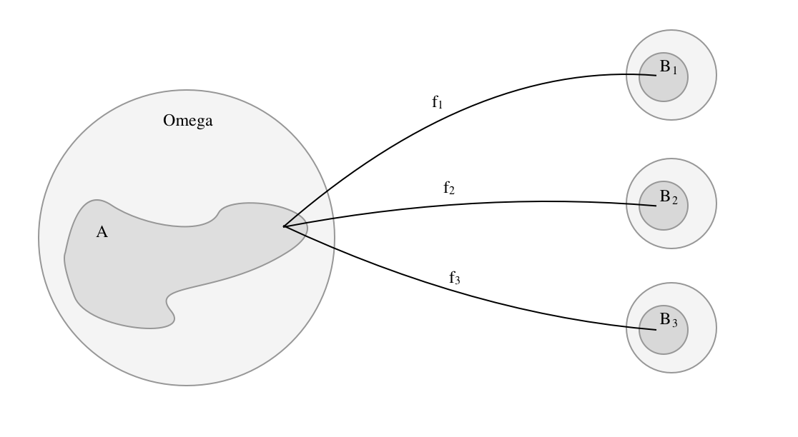
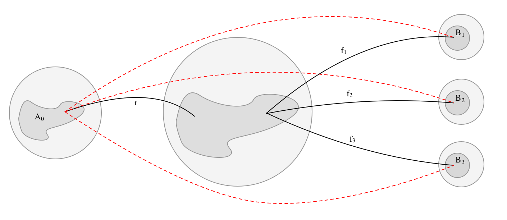

# Maß- und Integrationstheorie

## Woche 1

## Woche 2

## Woche 3

### 4. Abbildung zwischen messbaren Räumen

In erster Linie beschäftigt sich die Mathematik mit Beziehungen zwischen Strukturen. In unserem Fall mit Abbildungen zwischen $\sigma$-Algebren.

#### 4.1 Messbare Abbildungen

Gegeben seien zwei messbare Räume $(\Omega_1, \mathcal A)$ und $(\Omega_2, \mathcal B)$ und eine Abbildung $f: \Omega_1 \to \Omega_2$. Die Abbildung $f$ heißt ___$(\mathcal A$-$\mathcal B)$-messbar___, wenn das Urbild jeder messbarer Menge messbar ist:

$$
  \forall B \in \mathcal B: f^{-1}(B) \in \mathcal A.
$$

Ist $\Omega_2 = \mathbb R$, so nennt man diese Funktion  ___messbar___.

Es gibt ein einfaches ___Messbarkeitskriterium___ für Funktionen, das lautet: Sei $\mathcal E$ ein Erzeuger von $\mathcal B$. Dann ist $f$ $(\mathcal A$-$\mathcal B)$-messbar genau dann, wenn

$$
  \forall E \in \mathcal E: f^{-1}(E) \in \mathcal A.
$$

Es reicht also, die Urbilder der erzeugenden Mengen zu betrachten. Der Erzeuger _muss nicht_ $\cap$-stabil sein.

_Beweis mit Prinzip der guten Menge._

1. Betrachte die gute Menge
   
   $$
      \mathcal F = \{ B \in \mathcal B : f^{-1}(B) \in \mathcal A \}.
   $$

2. Zeige, dass $\mathcal F$ eine $\sigma$-Algebra ist.
3. $\mathcal F$ enthält einen Erzeuger von $\mathcal B$.
4. Damit: $\mathcal E \subset \mathcal F \implies \sigma(\mathcal E) = \mathcal B \subset \mathcal F$.
5. $\mathcal B$ besitzt die gute Eigenschaft durch $\mathcal F$.

**Beispiele**

* Eine Funktion zwischen zwei Borelräumen $(\mathbb R^p, \mathcal B^p)$ und $\mathbb R^q, \mathcal B^q$ heißt ___Borel-messbar___.
* Stetige Abbildungen $f: \mathbb R^p \to \mathbb R^q$ sind Borel-messbar (Aufgabe für dich 😋)
* Zur ___Borel-Messbarkeit___: Sei $(\Omega, \mathcal A)$ ein messbarer Raum und eine Funktion $f: \Omega \to \mathbb R^1$ gegeben. Dann ist $f$ genau dann eine $(\mathcal A-\mathcal B^1)$-messbare Funktion, wenn eine der folgenden Aussagen für alle $t \in \mathbb R$ gilt:
  * $\{f < t \} = \{ x \in \Omega : f(x) < t \} = f^{-1}((-\infty, t)) \in \mathcal A$
  * $\{f \leq t \} \in \mathcal A$
  * $\{f > t \} \in \mathcal A$
  * $\{f \geq t \} \in \mathcal A$
* Kompositionen messbarer Funktionen sind messbar (folgt sehr einfach aus der Definition)

**Von Abbildungen erzeugte $\sigma$-Algebren**

Sei $\Omega$ eine Grundmenge und $(\Omega_2, \mathcal B)$ ein messbarer Raum. Sei $f: \Omega_1 \to \Omega_2$. Das ___Urbild der $\sigma$-Algebra $\mathcal B$ bezüglich $f$___ ist definiert als 

$$
  \mathcal A = \{ f^{-1}(B) : B \in \mathcal B \}
$$

und ist eine $\sigma$-Algebra in $\Omega$.

* Dies ist die ___kleinste___ $\sigma$-Algebra, sodass $f$ eine $\mathcal A-\mathcal B$ messbare Funktion ist.
* Bezeichnung: die von $f$ erzeugte $\sigma$-Algebra, $\sigma(f)$.

**Achtung:** Bilder von $\sigma$-Algebren $\{ f(B) : B \in \mathcal B \}$ sind im Allgemeinen keine $\sigma$-Algebren.

Sei $\Omega_i, \mathcal B_i$ und $f_i: \Omega \to \Omega_i$ mit $i \in I$ gegeben. Dann ist

$$
  \mathcal A =\sigma(f_i, i \in I) = \sigma(\bigcup \sigma(f_i))
$$

die kleinste $\sigma$-Algebra, sodass alle Funktionen  $\mathcal A-\mathcal B_i$ messbar sind.

**Theorem 4.5**

Sei $\Omega$ eine Grundmenge. Gegeben seien messbare Räume $\Omega_0, \mathcal A_0$ und $\Omega_i, \mathcal B_i$ sowie Abbildungen $f: \Omega_0 \to \Omega$ und $f_i: \Omega \to \Omega_i$. Die Funktion $f$ ist genau dann, $(\mathcal A_0, \sigma(f_i, i \in I))$-messbar, wenn für jedes $i \in I$ die Abbildung $f_i \circ f$ $(\mathcal A_0, \mathcal B_i)$-messbar ist.

#### 4.2 Bildmaße

**Theorem 4.6.** Gegeben seien zwei messbare Räume $(E, \mathcal E)$ und $(F, \mathcal F)$ und eine _messbare_ Abbildung $f: (E,\mathcal E) \to (F,\mathcal F)$. Zudem sei ein Maß $\mu: \mathcal E \to \mathbb R$ gegeben. Dann ist durch

$$
  \nu(B) = \mu(f^{-1}(B)), \quad B \in \mathcal F
$$

ein Maß auf $(F,\mathcal F)$ gegeben. Dieses Maß heißt ___Bild des Maßes $\mu$ bezüglich $f$___. Dieses wird auch mit $\mu \circ f^{-1}$ bezeichnet. Man spricht auch vom ___induzierten Maß___ und benutzt Schreibweisen wie $\mu(f)$ oder $\mu_f$ oder $\mu(f \in B)$.

_Beweis_

- Zeige die Wohldefiniertheit mithilfe der Messbarkeit von $f$
- Nichtnegativität und $\nu(\emptyset) = 0$ ist einfach
- Die $\sigma$-Additivität ist auch nicht so schwer 

**Verteilungsgesetze von Zufallsgrößen.** Sei $(\Omega, \mathcal F, \mathbb P)$ ein Wahrscheinlichkeitsraum und $X$ eine ___Zufallsgröße___, d.h.

$$
  X: (\Omega, \mathcal F) \to (\mathbb R^1, \mathcal B^1).
$$

Dann ist $\mathbb P \circ X^{-1}$ ein Wahrscheinlichkeitsmaß auf $(\mathbb R^1, \mathcal B^1)$. Für $A \subset \mathcal B$ ist $\mathbb P(X \in A)$ die Wahrscheinlichkeit, dass die Zufallsgröße $X$ Werte in $A$ annimmt.

#### 4.3. Messbare numerische Funktionen

Eine Funktion heißt ___numerisch___, wenn sie in die erweiterte Zahlengerade $\mathbb R \cup \{ \infty, -\infty \}$ abbildet. Mit $\bar \mathfrak B$ bezeichnen wir die Borelmengen von $\bar \mathbb R$:

$$
  \bar \mathfrak B = \{ B \subset \bar \mathbb R : B \cap \mathbb R \in \mathfrak B\}.
$$

**Definition (messbar numerisch)**

Sei $(\Omega, \mathcal A)$ ein messbarer Raum. Eine Abbildung $f: \Omega \to \bar \mathbb R$ heißt ___$\mathcal A$-messbare numerische Funktion___, wenn sie $(\mathcal A, \bar \mathfrak B)$-messbar ist.

Meistens lassen sich alle Aussagen über messbare Funktionen auch auf messbar numerische Funktionen übertragen. So ist $f: \Omega \to \bar \mathbb R$ $\mathcal A$-messbar, wenn für alle $t \in \mathbb R$ gilt

$$
  \{ f < t\} \in \mathcal A, \; \text{oder} \; \{ f \leq t\} \in \mathcal A.
$$

Das ___Maximum___ wird mit $\lor$ und das ___Minimum___ mit $\land$ bezeichnet.

$$
  f^+(x) = f(x) \lor 0 \quad \text{und} \quad f^-(x) = - (f(x) \land 0)
$$

$$
  f = f^+ - f^- \quad \text{und} \quad |f| = f^+ + f^-.
$$

Jede messbare Funktion ist natürlich auch messbar numerisch.

**Bemerkung 4.11**

Seien $f,g$ messbar numerische Funktionen auf $(\Omega, \mathcal A)$. Folgende Ausdrücke sind auch messbar numerisch:

1. $f \lor g$, $f \land g$, $f^+$, $f^-$ und $|f|$
2. $\alpha f$, $f+g$, $f-g$, $f \cdot g$, $f / g$
3. folgende Mengen sind $\mathcal A$-messbar

$$
  \{ f < g \}, \{ f \leq g \}, \{ f = g\}, \{ f \neq g \}.
$$

_Beweis._

1. $\{ f \lor g < t\} = \{ f < t \} \cap \{ g < t \} \in \mathcal A$.
2. Übungsaufgabe
3. Die Messbarkeit der Menge $\{ f < g \}$ folgt aus

$$
  \{ f < g \} = \bigcup_{t \in \mathbb Q}\{ f < t < g \} = \bigcup_{t \in \mathbb Q}(\{ f < t \} \cap \{ t < g\}).
$$
3. Nun ist $\{ f < t \}$ als $\{ t < g \}$ messbar, da $f$ und $g$ messbar numerische Funktionen sind. Die Messbarkeit der anderen Mengen ergibt sich aus

$$
\begin{aligned}
  \{ f \neq g \} &= \{ f < g \} \cup \{ g < f \}, \\
  \{ f = g \} &= \{ f \neq g \}^c, \\
  \{ f \leq g \} &= \{ f = g \} \cup \{ f < g \}.
\end{aligned}
$$

**Behauptung 4.12 (Grenzwerte und messbar numerische Funktionen)**

Sei $f_i: (\Omega, \mathcal A) \to (\bar \mathbb R, \bar \mathfrak B)$ eine Folge messbarer numerischer Funktionen. Dann sind auch $\inf_n f_n, \sup_n f_n, \liminf f_n, \limsup f_n$ messbarr numerische Funktionen. Gibt es für jedes $x$ den Grenzwert

$$
  \lim f_i(x)
$$

so ist auch $f(x) = \lim f_i(x)$ eine messbar numerische Funktion.

### 5. Integrationstheorie

Eine Funktion $f: (\Omega, \mathcal A) \to (\mathbb R, \mathfrak B)$ heißt ___elementar___, wenn sie messbar ist und nur endlich viele Werte annimmt.

Sind $\alpha_1,...,\alpha_n$ die verschiedenen Werte von $f$, so definiere

$$
  A_k = f^{-1}(\{ \alpha_k \}).
$$

Dann hat $f$ die Gestalt

$$
  f = \sum^n_{k=1} \alpha_k 1_{A_k}.
$$

Im folgenden bezeichne $\mathcal E$ die Menge aller elementaren Funktionen auf $(\Omega, \mathcal A)$ und $\mathcal E_+$ alle elementare Funktion, die nichtnegativ sind.

#### 1. Integral nichtnegativer elementarer Funktionen

Sei $f = \sum^n_{k=1} \alpha_k 1_{A_k}$. Dann definiere das Integral als

$$
  \int f d\mu = \sum^n_{k=1} \alpha_k \mu(A_k) \in \mathbb R \cup \{ \infty\}.
$$

Nun bleibt die Wohldefiniertheit bei verschiedenen disjunkten Darstellungen von $f$ zu zeigen. Dies kann man auf Seite 68 nachlesen.

_Eigenschaften._

- $A \in \mathcal A \implies 1_A \in \mathcal E_+$ und $\int 1_A d\mu = \mu(A)$
- Homogenität ($\alpha \geq 0, \int \alpha f d \mu = \alpha \int f d \mu$)
- Additivität
- Monotonie ($f \leq g \implies \int f d\mu \leq \int g d \mu$)

#### 2. Integral nichtnegativer messbarer numerischer Funktionen

Für eine nichtnegative messbare numerische Funktion $f: (\Omega, \mathcal A) \to (\bar \mathbb R, \bar \mathfrak B)$ definieren wir

$$
  \int f d\mu = \sup\left\{ \int g d \mu : g \in \mathcal E_+, g \leq f \right\}.
$$

Diese Darstellung mit dem Supremum ist nicht sehr handlich, weshalb wir eine andere Darstellung herleiten werden.

**Behauptung 5.1. (nichtnegative messbare numerische Funktionen lassen sich durch elementare Funktionen approximieren)**

Für jede nichtnegative messbare numerische Funktion $f$ gibt es nichtnegative elementare Funktionen $(f_n) \subset \mathcal E_+$ mit $f_n(x) \uparrow f(x)$ für alle $x \in \Omega$.

_Beweis._

$$
  f_n(x) = \begin{cases}
    k2^{-n}, &\, k2^{-n} \leq f(x) < (k+1)2^{-n}, k = 0,...,n2^n-1 \\
    n, &\, f(x) \geq n
  \end{cases}
$$

**Behauptung 5.2.**

$$
  (f_n) \subset \mathcal E_+, f_n \uparrow f \implies \int f_n d \mu \uparrow \int f d \mu.
$$ 

_Beweis._

Nachzulesen im Skript auf Seite 70.

Dies führt uns zu einer äquivalenten Definition

$$
  \int f d \mu = \lim_{n \to \infty} \int f_n d \mu,
$$

wobei $(f_n) \subset \mathcal E_+$ und $f_n \uparrow f$.

#### 3. Integral messbarer numerischer Funktionen

Sei $f: (\Omega, \mathcal A) \to (\bar \mathbb R, \bar \mathfrak B)$ messbar. Definiere das Integral

$$
  \int f d \mu = \int f^+ d\mu - \int f^- d\mu,
$$

falls mindestens eines der Integral auf der rechten Seite endlich ist.

Die Funktion $f$ heißt ___integrierbar___, falls beide Integrale endlich sind, d.h.

$$
  \int |f| d\mu < \infty.
$$

Man schreibt auch (für $A \in \mathcal A$)

$$
  \int f(x) d\mu(x), \quad \int_A fd \mu = \int 1_A f d\mu,\quad \int f d\lambda = \int f(x) dx.
$$

Es gilt die ___Dreiecksungleichung___. Seien $f$ und $g$ integrierbare numerische Funktionen. Dann gilt

$$
  \left|\int f d \mu\right| \leq \int |f| d \mu.
$$

_Beweis._

Selber 🤓.

#### 5.2 Integration bezüglich eines Bildmaßes

Betrachte folgende Situation

$$
\begin{aligned}
  (F, \mathcal F) &\overset{f}{\to} (G, \mathcal G) \overset{g}{\to} (\bar \mathbb R, \bar \mathfrak B) \\
  \mu & \to \nu = \mu \circ f^{-1}.

\end{aligned}
$$

**Transformationssatz für Integrale**

Ist $\nu$ das Bild des Maßes $\mu$ bezüglich $f$ und ist $g \geq 0$, so gilt 

$$
  \int g d \nu = \int g \circ f d \mu.
$$

_Beweis._

1. Zeige es zuerst für nichtnegative elementare Funktionen $g$.
2. Monotone Approximation für die anderen Fälle

**Folgerung 5.4**

Jetzt sei $g$ eventuell auch negativ. Dann ist $g$ $\nu$-integrierbar genau dann, wenn $g \circ f$ $\mu$ integrierbar ist. 

**Beispiel 5.5**

Verteilungsgesetz, Lebesgue-Stieltjes-Integral, ... 

#### 5.3 Fast überall bestehende Eigenschaften

ddfs

#### 5.4 Konvergenzsätze